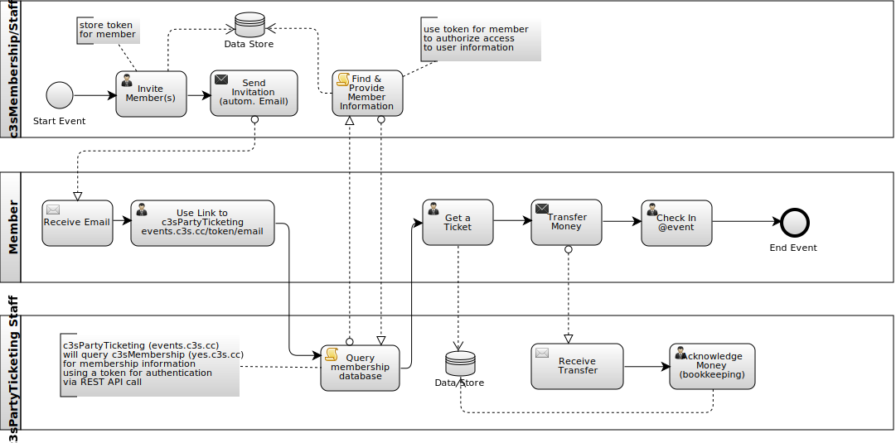
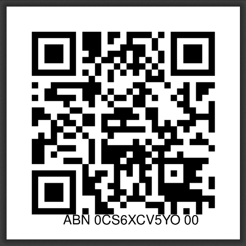
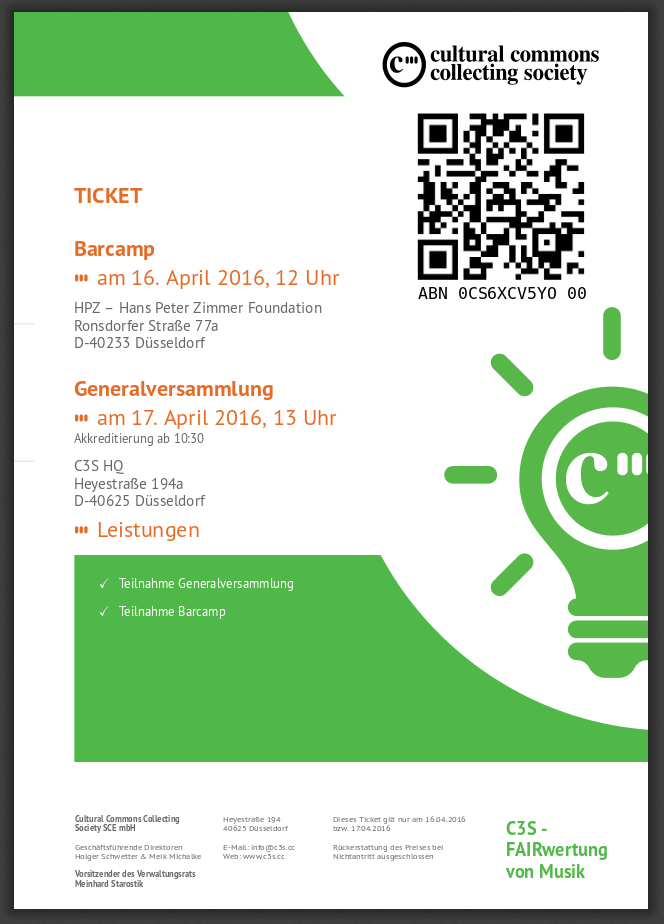

.. _sec_overview:

========
Overview
========

.. _overview_ticketing:

Tickets for Members and Non-Members
===================================

When a user comes to the app, there can be two main causes:

* A C3S member clicked a personalized link (must be a C3S member)
* An anonymous user clicked a public link or visited https://events.c3s.cc

Members may participate in the General Assembly and the BarCamp.
Non-members may attend the BarCamp.

Invitation links are sent from *c3sMembership*.
They contain a token that is stored in the *c3sMembership* database.
The token must be used together with the corresponding email (also part of the link).

Nonmember-Tickets
-----------------

When this ticketing system was first built, there were only 'non-member' tickets.
We celebrated the inauguration of our headquarters in Düsseldorf
and everybody was invited.

There were different categories of tickets:

* Normal
* First Class (with a shirt)
* Green Mamba (with a sweater)
* TODO: revisit options of that time

People were able to order tickets for more than one person,
because we did not want to force every person to have her own ticket,
but wanted to allow them to bring friends (and buy entry for them too).

From the second incarnation on, the BarCamp tickets became the "free for all" option.

Member-Tickets
--------------

Only members of C3S SCE are invited to the general assembly.
Of course they may also attend the BarCamp.

As we wanted to offer tickets covering both BarCamp and general assembly,
we let members choose from both options (and more),
so we needed a way to make sure,
only members would be able to get tickets for the general assembly.

The solution was to send out invitation emails
from the C3S SCE membership app (c3sMembership)
when staff commands this.

We sent out emails with links comprising a members email address
and a unique token that would be stored in the membership app for further reference.

When a member gets a link to authenticate them,
she clicks on that link and is sent to the ticeting app.
The ticketing app uses the information from the link (email + token)
to query the membership app and fetch the data from the membership app:

* first and last name
* membership type
* legalentity flag

The following BPMN diagram shows some of the actions or steps involved:

   
   From invitation (c3sMembership) to ticket and event in BPMN.
   Click on image for a larger view.

Other Functionality
===================

Ticket Generation Views
-----------------------

When users buy tickets,
they can eihter just use the alphanumeric *code* they receive
or download one of two available PDF ticket formats.

The alphanumeric code is sufficient for entry,
so the following two paragraphs are solely about convenience features.

Mobile Ticket
~~~~~~~~~~~~~

:ref:`fig-mobile-ticket` shows a *mobile* ticket.

.. _`fig-mobile-ticket`:

   just a QR code and some 'readable' info

..   :align: right

Printable Ticket
~~~~~~~~~~~~~~~~

:ref:`fig-printable-ticket` shows a ticket for printout.

.. _`fig-printable-ticket`:

   A4 PDF ticket for printout.

..   :align: right

Backend Dashboard
-----------------

Staff gets to see a **listing of tickets** in the backend
on the so called dashboard.

There, staff can **acknowledge payments** for tickets
both persisting the information in the database and
sending out emails to the ticketeers,
confirming their payments.

After this, staff can **send ticket emails** 
supplying them with links to the ticket views.

Staff can also reproduce any of the tickets listed.

Cashiers Desk
-------------

When the day of the event arrives,
there are several methods of "checking people in" to the venue.

